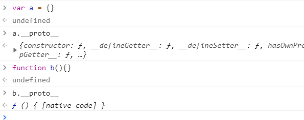

# Prototype和constrotor
在js中,Class就是Prototype
--
平时Object,Function等这些属于构造函数,在内存中不以对象的形式存在,是对象的构造函数constrotor的暴露,构造函数有两个属性:prototype和__proto__,其中,prototype的含义是构造函数的载体,也即类似于Class;而__proto__是表示何种对象,__proto__指向prototype性的对象,含有__proto__的内容即表示这是个对象。构造函数的prototype属性是类对象或是结构（Struct）。

在js中,实例也可以再产生实例,宛如继承一般。__proto__指明一种继承关系。__proto__是struct和struct之间的单向连接关系。
有如下事实:
    
```javascript
//因为Object是构造函数,其在实质上是函数对象,故Object的__proto__指向Function所对应的prototype,也即类对象。
Object.__proto__ === Function.prototype//true

//Object的类对象是在js中最高的,但它是在js内部定义的。(预先定义),没有更抽象的结构作为它的父结构。
Object.prototype instanceof Object//false
Object.prototype.__proto__ //null

//Function的结构对象是Object的实例
Function.prototype instanceof Object //true
Function.prototype.__proto__ ===Object.prototype //true

//Function的构造函数和它的载体结构（Struct）是一致的,鉴于不能提起自己的鞋带，故Function.prototype是native Code（f()）,外部定义的函数。
Function.__proto__ === Function.prototype
```
在js中,归根到底，只有两种内存结构,Function.prototype和Object.prototype。他们是父子关系。

